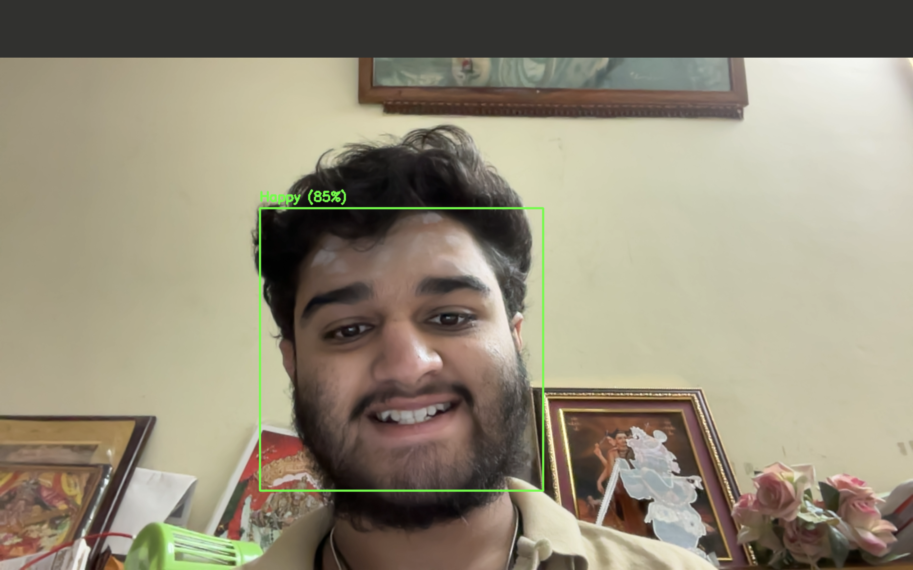

# Advanced Face & Hand Recognition System

A real-time system that detects facial emotions and hand gestures using live video input.

## Features
- Real-time facial emotion recognition
- Hand gesture detection
- Multi-object detection support

## Tech Stack
- Python
- MediaPipe
- OpenCV
- Haar Cascades

## How It Works
The system captures live video input and applies machine learning-based detection models
to identify facial expressions and hand gestures in real time.

## How to Run
1. Clone the repository
2. Install dependencies:
   pip install -r requirements.txt
3. Run:
   python main.py

## Applications
- Healthcare monitoring
- Human-computer interaction
- Automation systems

  
  ## 🚀 Overview
A real-time computer vision system that performs **facial emotion recognition** and **hand gesture detection** using live camera input.  
Built using **OpenCV** and **MediaPipe**, the system processes video frames in real time and overlays detected emotions and gestures with confidence indicators.

## 🧠 Key Features
- Real-time facial emotion detection  
- Hand gesture recognition using MediaPipe landmarks  
- Multi-object detection (face + hands simultaneously)  
- Live bounding boxes and labels  
- Screenshot capture functionality

## Results

### Face & Hand Recognition Output

